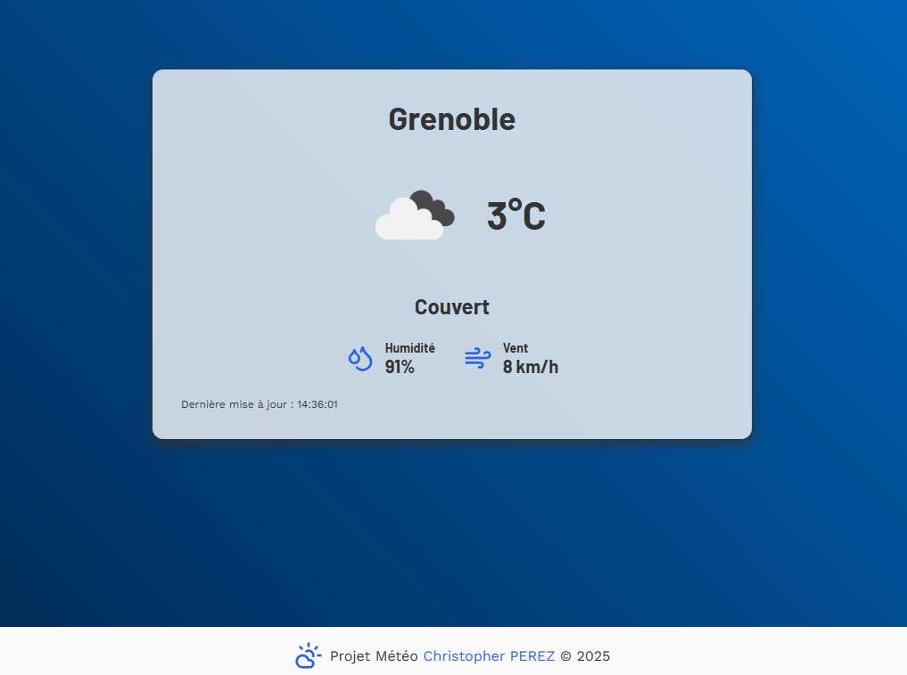

# 🌦️ Projet Météo

Ce projet est une application web permettant d'afficher les prévisions météorologiques en temps réel.  
Il a été réalisé en utilisant **React, TypeScript et l'API OpenWeather**.

Projet développé par <a href="https://github.com/Chr1stopherPerez" target="_blank">Christopher PEREZ</a>, pour un brief demandé par [SIMPLON](https://www.simplon.co/).

## But du Projet

L'objectif principal de ce projet est de :

- Récupérer et afficher les **données météo** de plusieurs villes prédéfinies.
- Afficher une interface **moderne et responsive** adaptée aux écrans embarqués.
- Mettre en place un **système de mise à jour automatique** des données toutes les heures.

## Fonctionnalités

- **Affichage des données météo** (température, humidité, vent, etc.).
- **Sélection de ville** (liste préconfigurée des arrêts de train entre Grenoble et Chambéry en vue Mobile).
- **Mise à jour automatique** toutes les heures.
- **Stockage en cache** pour optimiser les performances.
- **Interface adaptée aux écrans mobiles et fixes**.

### Technologies Utilisées


---

## Structure du Projet

- **`index.html`** : Fichier principal contenant le point d'entrée de l'application.
- **`src/components/WeatherDisplay.tsx`** : Composant principal affichant la météo.
- **`src/hooks/useWeather.ts`** : Hook personnalisé pour gérer les données météo.
- **`src/utils/weather.ts`** : Gestion des appels API et mise en cache.
- **`src/css/styles.css`** : Fichier CSS pour le design et la mise en page.
- **`src/config/cities.json`** : Liste des villes préconfigurées.
- **`tests/`** : Tests unitaires réalisés avec Jest et Testing Library.

---

### Configuration

1. **Cloner le projet**

   ```bash
   git clone https://github.com/Chr1stopherPerez/Projet_Meteo.git
   cd Projet_Meteo

   ```

2. **Installer les dépendances**

   ```bash
   npm install

   ```

3. **Créer un fichier .env et ajouter sa clé API OpenWeather**

4. **Lancer l'application en mode développement**

   ```bash
   npm run dev

   ```

5. **Exécuter les tests**

   ```bash
   npm test

   ```

---

## Captures d'Écran


